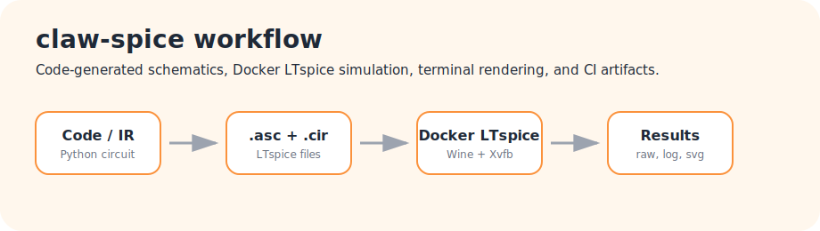

# claw-spice

Docker-first LTspice automation for AI-assisted circuit design.

`claw-spice` is an enablement environment for coding agents and humans who want
to generate, simulate, render, inspect, and iterate on analog circuits without
installing project dependencies on the host. It wraps LTspice in Docker, exposes
a terminal CLI, generates real LTspice netlists and schematics, renders those
schematics for review, and publishes reproducible artifacts through GitHub
Actions and GitHub Pages.

- Live site: <https://jean-reinhold.github.io/claw-my-ltspice/>
- Repository: <https://github.com/Jean-Reinhold/claw-my-ltspice>

## Visual Overview

The repo includes generated schematic previews and waveform plots. These are not
hand-drawn marketing images. They are produced by the same tooling that agents
and humans use during the engineering loop.



### Rendered Schematics

<p>
  
  
</p>

### Simulation Plots

<p>
  
  
</p>

## Project Goal

The main goal is to make LTspice usable as a fast feedback loop for AI coding
agents. An agent should not only write a plausible circuit file. It should be
able to:

1. State the expected circuit behavior.
2. Generate a `.cir` netlist and a routed `.asc` schematic.
3. Run LTspice in a reproducible container.
4. Inspect `.log` errors, warnings, and `.meas` results.
5. Inspect `.raw` traces or plots when relevant.
6. Render the schematic and reject unreadable output.
7. Iterate from evidence instead of guesswork.

The current weekend-scale research direction is to use this environment for an
analog neural-network experiment where operations are built from op-amp
circuits. Longer term, the same workflow could support an "autoresearch for
hardware" loop: give an agent a circuit-level problem, let it propose hardware,
simulate alternatives, inspect measurements, and optimize the approach
iteratively.

## What Is Included

- `./claw-spice`, a host wrapper for the containerized CLI.
- LTspice running in Docker through Wine and Xvfb.
- Code-generated `.cir` netlists and `.asc` schematics.
- Explicit schematic routing, labels, flags, directives, and preview rendering.
- Transient simulation workflows with `.meas` summaries.
- `.raw` trace listing and SVG waveform plotting.
- Terminal schematic previews via `chafa`.
- Real-renderer SVG previews for examples and GitHub Pages.
- Project-local OpenCode agents and skills for circuit design, simulation,
  debugging, model handling, schematic layout, and CI.
- GitHub Actions workflows for tests, simulation smoke checks, render artifacts,
  manual simulation runs, and Pages publishing.

## Quick Start

The host should only need Docker, Docker Compose, Git, and OpenCode if you want
to use the included agents.

```bash
git clone git@github.com:Jean-Reinhold/claw-my-ltspice.git
cd claw-my-ltspice
./claw-spice build
./claw-spice doctor
./claw-spice examples list
./claw-spice examples run --skip-sim
./claw-spice show examples/transient/rc-step/rc_step.asc --terminal
```

On Apple Silicon, if the default local LTspice/Wine build hits Wine emulation
issues, use the prebuilt-base fallback:

```bash
./claw-spice build-prebuilt
```

The fallback layers `claw-spice` tooling on top of an existing LTspice/Wine
image. The default `./claw-spice build` path remains the preferred
licensing-clean local build because it downloads LTspice from Analog Devices
during the image build.

You can also call Docker Compose directly:

```bash
docker compose run --rm claw-spice claw-spice doctor
```

## CLI Workflow

Generate a circuit from a Python source file:

```bash
./claw-spice code build examples/transient/rc-step/rc_step.py
```

Run a transient simulation:

```bash
./claw-spice sim run examples/transient/rc-step/rc_step.cir
```

Inspect the simulation log:

```bash
./claw-spice log summary runs/latest/rc_step.log
```

List raw waveform traces:

```bash
./claw-spice raw traces runs/latest/rc_step.raw
```

Plot one or more traces:

```bash
./claw-spice raw plot runs/latest/rc_step.raw V(out) --output runs/latest/rc_step_vout.svg
./claw-spice raw plot runs/latest/opamp_summing.raw V(in1) V(in2) V(out) --output runs/latest/opamp_summing.svg
```

Render and open a schematic:

```bash
./claw-spice show examples/transient/rc-step/rc_step.asc
```

Render a schematic in the terminal:

```bash
./claw-spice show examples/transient/rc-step/rc_step.asc --terminal
```

## Example Circuits

The examples are small, inspectable circuits designed to exercise the full
generation, simulation, rendering, and documentation loop.

| Example | Generated Preview Path |
| --- | --- |
| RC step response | `examples/transient/rc-step/preview.svg` |
| Op-amp voltage follower | `examples/transient/opamp-voltage-follower/preview.svg` |
| Op-amp non-inverting gain | `examples/transient/opamp-noninverting/preview.svg` |
| Op-amp inverting gain | `examples/transient/opamp-inverting/preview.svg` |
| Op-amp inverting summing amplifier | `examples/transient/opamp-summing/preview.svg` |
| Op-amp difference amplifier | `examples/transient/opamp-difference/preview.svg` |
| Op-amp buffered active low-pass | `examples/transient/opamp-active-lowpass/preview.svg` |
| Precision half-wave rectifier | `examples/transient/precision-rectifier/preview.svg` |
| Sallen-Key low-pass filter | `examples/transient/sallen-key-lowpass/preview.svg` |
| Diode clipper spectrum | `examples/transient/diode-clipper-spectrum/preview.svg` |
| RLC step ringing | `examples/transient/rlc-step-ringing/preview.svg` |
| Passive RC spectrum split | `examples/transient/passive-rc-spectrum-split/preview.svg` |
| Practical op-amp integrator | `examples/transient/opamp-practical-integrator/preview.svg` |
| Practical op-amp differentiator | `examples/transient/opamp-practical-differentiator/preview.svg` |
| Simple configurable Schmitt trigger | `examples/transient/schmitt-trigger-simple/preview.svg` |
| Noisy temperature switch Schmitt trigger | `examples/transient/schmitt-trigger-temperature-switch/preview.svg` |
| Sallen-Key high-pass filter | `examples/transient/sallen-key-highpass/preview.svg` |

Refresh generated example outputs and docs assets through Docker:

```bash
./claw-spice examples run --skip-sim
./claw-spice docs assets
```

## AI Agent Contract

This repository includes OpenCode instructions under `.opencode/`. They define
the behavior expected from AI collaborators working on circuits in this repo:

- Use `./claw-spice`, not host package managers.
- State expected behavior before changing a circuit.
- Run tests and generation after source changes.
- Run LTspice through Docker when available.
- Inspect `.log` warnings, errors, and `.meas` values.
- Inspect `.raw` traces or waveform plots when relevant.
- Render schematics after generating or changing them.
- Treat bad schematic SVG output as a bug in the source layout.
- Track intended model sources and licenses in `models/manifest.toml`.

The point is to make automated circuit work reviewable. Generated artifacts
should be simulated, measured, rendered, and documented before they are accepted.

## Docker-First Dependency Policy

Do not install project dependencies on the host. The normal host dependencies
are:

- Docker
- Docker Compose
- Git
- OpenCode, if using the included agents and skills

LTspice, Wine, Python, schematic rendering tools, terminal preview tooling, docs
tooling, and test dependencies live inside Docker.

## LTspice In Docker

LTspice has no native Linux Docker runtime. This project runs the Windows
LTspice build inside a Linux container through Wine and Xvfb. On Apple Silicon,
the container runs as `linux/amd64` under emulation.

This repository does not redistribute LTspice. The Dockerfile downloads LTspice
from Analog Devices during image build. Review `NOTICE.md` before publishing any
container image that contains LTspice.

## GitHub Pages And Docs

The Pages scaffold under `docs-site/` publishes rendered schematics, terminal
previews, signal plot workflow docs, measurement workflow docs, and the full
project-local AI instructions.

Generate docs assets through Docker:

```bash
./claw-spice docs assets
```

Build the site locally through Docker:

```bash
./claw-spice docs build
```

Serve the site locally through Docker:

```bash
./claw-spice docs serve
```

## Repository Status

This is an active prototype. The core environment, CLI, examples, docs scaffold,
schematic rendering, and AI-agent workflow are in place. The next major work is
to expand transient simulation features for the analog neural-network experiment
and keep tightening the agent feedback loop around measurements, waveform
analysis, and schematic quality.
