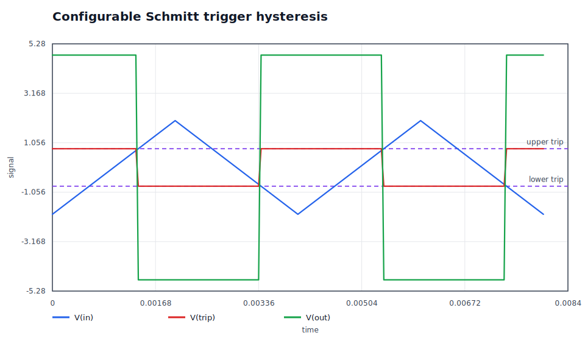
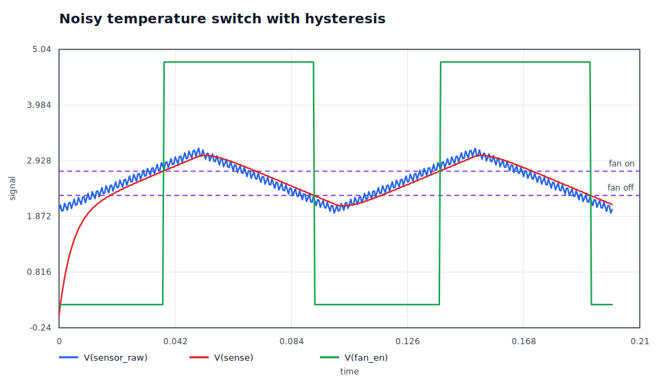

# Schmitt Trigger Walkthrough

The Schmitt trigger examples show why positive feedback is useful when a slow or
noisy analog signal must become a clean digital decision. Both examples use the
repo-owned `CLAW_IDEAL_OPAMP` model so the topology, measurements, and layout can
be reviewed without adding vendor model licensing questions.

| Example | Topology | Supply | Main lesson |
| --- | --- | --- | --- |
| `schmitt-trigger-simple` | Inverting Schmitt comparator | `+/-5 V` | Hysteresis width follows a simple feedback-divider ratio. |
| `schmitt-trigger-temperature-switch` | Non-inverting sensor conditioner | `0 V` to `5 V` | Filtering plus hysteresis turns a noisy sensor into a stable `fan_en` signal. |

Use the simple trigger first when validating threshold equations or schematic
routing. Use the temperature switch when you want a realistic single-supply
signal-conditioning problem with a noisy sensor and a load-control output.

List the registered examples with:

```bash
./claw-spice examples list
```

## Simple Configurable Trigger

The simple example is an inverting Schmitt comparator. The input drives the
inverting input, while the non-inverting input receives a fraction of the output
through `RHYS` and `RREF`.

```text
VTRIP = 4.8 * RREF / (RHYS + RREF)
```

With the default `RHYS=100k` and `RREF=20k`, the ideal trip level is about
`0.8 V`. A rising input crosses the upper threshold and drives the output low.
The low output moves the trip node to about `-0.8 V`, so the input must fall
below that lower threshold before the output returns high.

```bash
./claw-spice code build examples/transient/schmitt-trigger-simple/schmitt_trigger_simple.py
./claw-spice sim run examples/transient/schmitt-trigger-simple/schmitt_trigger_simple.cir
./claw-spice log summary runs/latest/schmitt_trigger_simple.log
./claw-spice raw plot runs/latest/schmitt_trigger_simple.raw V(in) V(trip) V(out) --output runs/latest/schmitt_trigger_simple.svg
./claw-spice show examples/transient/schmitt-trigger-simple/schmitt_trigger_simple.asc --terminal
```



Key measurements: `upper_trip`, `lower_trip`, `hysteresis_width`,
`expected_trip`, and `expected_hysteresis`.

| Measurement | Default expectation |
| --- | --- |
| `upper_trip` | near `+0.8 V` |
| `lower_trip` | near `-0.8 V` |
| `hysteresis_width` | near `1.6 V` |
| `expected_hysteresis` | near `1.6 V` |

## Temperature Switch Use Case

The practical example models a temperature-controlled fan-enable signal. The raw
sensor voltage includes high-frequency ripple to represent cable pickup or supply
noise. The circuit then adds three practical blocks before producing `fan_en`:

The sensor source is a conditioned voltage proportional to temperature, not a raw
thermistor macromodel. This keeps the example focused on comparator hysteresis,
input filtering, and stable load-control behavior.

- `RFLT` and `CFILT` attenuate ripple before the comparator input.
- `RTOP`, `RBOT`, and `CREF` make a quiet mid-supply reference.
- `RHYS` feeds back a small part of the output state, creating separate turn-on
  and turn-off thresholds.

For the default non-inverting topology, the sensor thresholds are:

```text
UPPER_TRIP = VREF * (1 + RIN/RHYS) - VOUT_L * (RIN/RHYS)
LOWER_TRIP = VREF * (1 + RIN/RHYS) - VOUT_H * (RIN/RHYS)
```

With `RIN=100k`, `RHYS=1Meg`, `VOUT_H=4.8`, and `VOUT_L=0.2`, the turn-on point
is near `2.73 V`, the turn-off point is near `2.27 V`, and the hysteresis band is
about `460 mV`.

```bash
./claw-spice code build examples/transient/schmitt-trigger-temperature-switch/schmitt_trigger_temperature_switch.py
./claw-spice sim run examples/transient/schmitt-trigger-temperature-switch/schmitt_trigger_temperature_switch.cir
./claw-spice log summary runs/latest/schmitt_trigger_temperature_switch.log
./claw-spice raw plot runs/latest/schmitt_trigger_temperature_switch.raw V(sensor_raw) V(sense) V(fan_en) --output runs/latest/schmitt_trigger_temperature_switch.svg
./claw-spice show examples/transient/schmitt-trigger-temperature-switch/schmitt_trigger_temperature_switch.asc --terminal
```



Key measurements: `turn_on_sensor`, `turn_off_sensor`, `hysteresis_width`,
`expected_upper`, `expected_lower`, `fan_on_time`, `fan_en_avg`, `raw_ripple_pp`,
`filtered_ripple_pp`, and `ripple_reduction`.

| Measurement | Default expectation |
| --- | --- |
| `turn_on_sensor` | near `2.73 V` |
| `turn_off_sensor` | near `2.27 V` |
| `hysteresis_width` | near `0.46 V` |
| `ripple_reduction` | greater than `1` |

## Design Tuning

Use a wider hysteresis band when the sensor is noisy or the controlled load would
wear out from rapid toggling. Use a narrower band when the controlled process can
tolerate more switching and needs tighter regulation.

For the simple inverting trigger, increase `RREF` or decrease `RHYS` to widen the
band. For the practical non-inverting trigger, decrease `RHYS` relative to `RIN`
to widen the band.

Quick tuning recipes:

| Goal | Simple trigger change | Temperature switch change |
| --- | --- | --- |
| Wider hysteresis | Increase `RREF` or decrease `RHYS` | Decrease `RHYS` relative to `RIN` |
| Narrower hysteresis | Decrease `RREF` or increase `RHYS` | Increase `RHYS` relative to `RIN` |
| Less sensor ripple at comparator | Not applicable | Increase `RFLT * CFILT` after checking response time |

## Verification Checklist

Before accepting changes to either Schmitt example, collect these artifacts:

- Generated `.cir` and `.asc` files from the Python source.
- LTspice `.log` summary showing all Schmitt `.meas` statements succeeded.
- Raw trace list confirming the plotted nodes are present.
- Waveform plot showing input, threshold or filtered sensor, and output state.
- Rendered schematic preview with explicit wires, readable labels, and no missing
  symbols.
