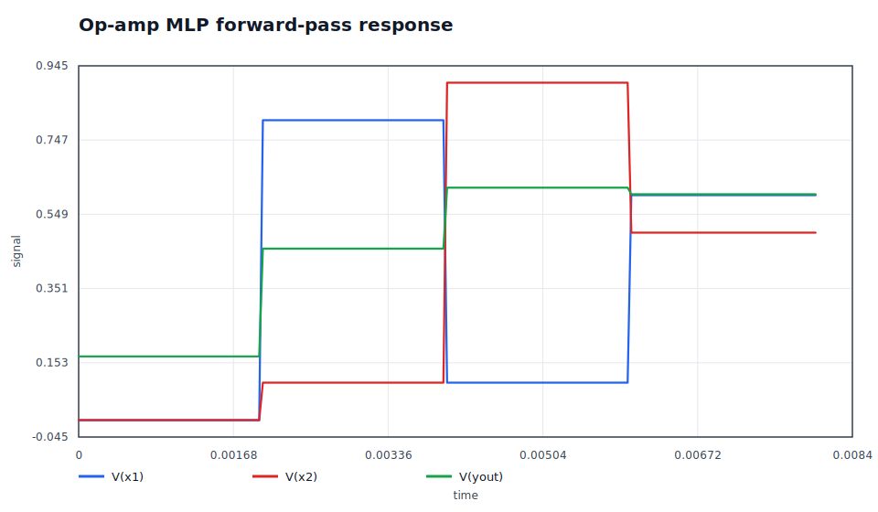

# Plots And FFT

`claw-spice` can create SVG plots directly from LTspice `.raw` files. The goal
is to make waveform inspection part of the repeatable engineering loop instead
of a manual screenshot step.

## Time-Domain Plots

List the available traces first:

```bash
./claw-spice raw traces runs/latest/rc_step.raw
```

Plot one or more traces:

```bash
./claw-spice raw plot runs/latest/rc_step.raw V(in) V(out) --output runs/latest/rc_step.svg
./claw-spice raw plot runs/latest/opamp_summing.raw V(in1) V(in2) V(out) --output runs/latest/opamp_summing.svg
```

Useful options:

- `--x <trace>` selects a non-default x-axis trace.
- `--title <text>` sets a custom plot title.
- `--png` also converts the SVG to PNG when `rsvg-convert` or `resvg` is available.

## FFT Spectrum Plots

Use `raw fft` when a transient run contains a periodic or mixed-frequency signal:

```bash
./claw-spice raw fft runs/latest/sallen_key_lowpass.raw V(out) --output runs/latest/sallen_key_lowpass_fft.svg
```

The FFT implementation is dependency-free and intentionally conservative:

- It transforms one selected signal trace at a time.
- It uses the time axis as the sample spacing source.
- It removes the DC mean before the transform.
- It applies a Hann window to reduce spectral leakage.
- It emits a single-sided magnitude spectrum in hertz.
- It caps the transform length to keep CLI use responsive without requiring NumPy.

For production-grade spectral analysis, keep using the exported `.raw` data with
specialized tools when you need window selection, calibrated units, or very large
sample counts. The built-in FFT plot is for quick engineering evidence and docs
artifacts.

## Expected Example Plots

These documentation plots show expected signal shapes. Real simulation plots
should be regenerated from each run's `.raw` output.





